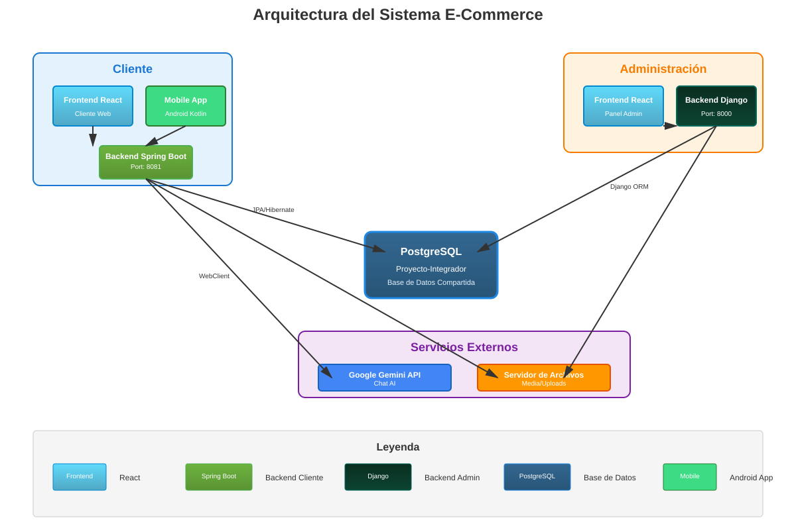
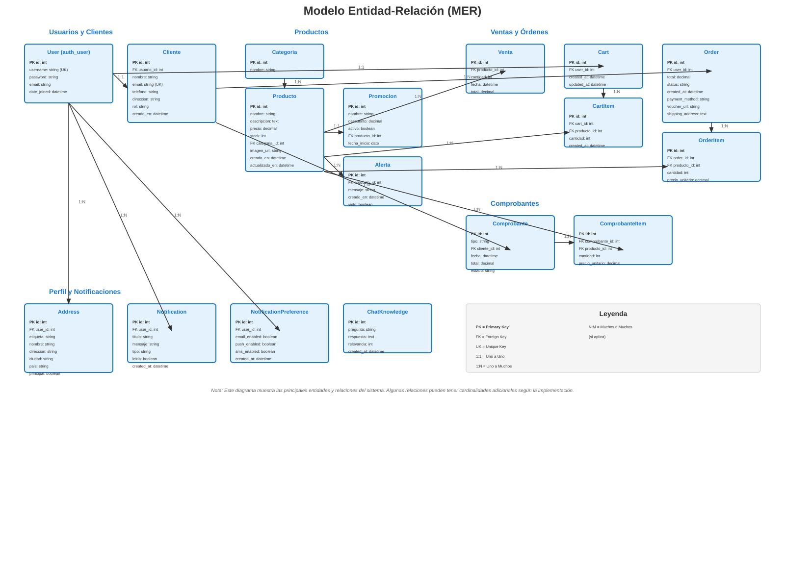
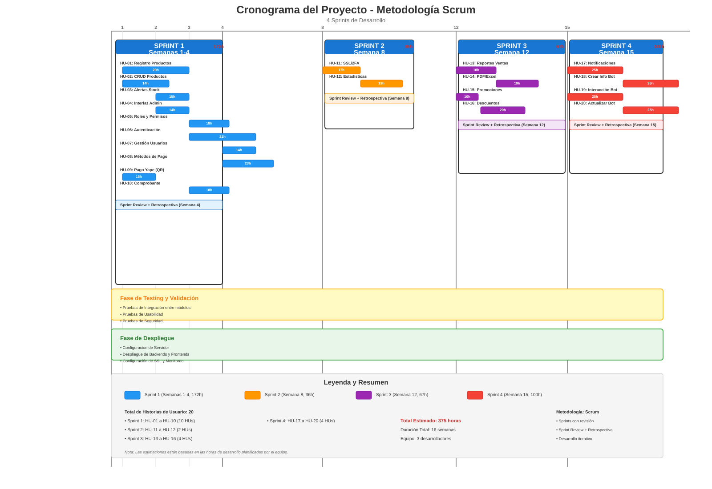

# Proyecto Integrador - Sistema E-Commerce

## 📋 Descripción del Proyecto

Sistema de comercio electrónico completo desarrollado como proyecto integrador, que incluye:

- **Panel de Administración**: Backend Django (Python) y Frontend React para gestión de productos, ventas, clientes y comprobantes
- **Portal de Cliente**: Backend Spring Boot (Java) y Frontend React para compras online
- **Aplicación Móvil**: Aplicación Android (Kotlin) para clientes
- **Base de Datos**: PostgreSQL compartida entre ambos backends

## 🏗️ Arquitectura del Sistema

### Diagrama de Arquitectura



### Descripción de Componentes

#### **Frontend Admin (React)**
- **Puerto**: 3000 (desarrollo)
- **Tecnologías**: React 19, Material-UI, Chart.js, Tailwind CSS
- **Funcionalidades**: 
  - Gestión de productos y categorías
  - Administración de ventas
  - Gestión de clientes y usuarios
  - Generación de comprobantes
  - Reportes y estadísticas

#### **Backend Admin (Django)**
- **Puerto**: 8000
- **Tecnologías**: Django 5.2, Django REST Framework, JWT
- **APIs**: RESTful para productos, ventas, clientes, comprobantes
- **Base de Datos**: PostgreSQL

#### **Frontend Cliente (React)**
- **Puerto**: 3001 (desarrollo)
- **Tecnologías**: React 19, Tailwind CSS, Heroicons
- **Funcionalidades**:
  - Catálogo de productos
  - Carrito de compras
  - Checkout y órdenes
  - Perfil de usuario
  - Chat con IA

#### **Backend Cliente (Spring Boot)**
- **Puerto**: 8081
- **Tecnologías**: Spring Boot 3.2, Spring Security, JPA/Hibernate
- **APIs**: RESTful para autenticación, productos, carrito, órdenes, chat
- **Integración**: Google Gemini API para chat asistente
- **Base de Datos**: PostgreSQL (compartida con Django)

#### **Mobile App (Android)**
- **Tecnologías**: Kotlin, Android SDK, Retrofit
- **Funcionalidades**: Similar al frontend web de cliente

#### **Base de Datos (PostgreSQL)**
- **Nombre**: Proyecto-Integrador
- **Puerto**: 5432
- **Uso compartido**: Ambos backends acceden a la misma base de datos

## 📊 Modelo Entidad-Relación (MER)

### Diagrama MER



### Descripción de Entidades Principales

#### **Usuario y Cliente**
- **User (auth_user)**: Usuario del sistema Django
- **Cliente**: Perfil extendido con información adicional y roles

#### **Productos**
- **Categoria**: Clasificación de productos
- **Producto**: Información del producto (nombre, precio, stock, imagen)
- **Promocion**: Descuentos aplicables a productos
- **Alerta**: Notificaciones de stock bajo

#### **Ventas y Órdenes**
- **Venta**: Registro de ventas en el sistema admin
- **Cart**: Carrito de compras del cliente
- **CartItem**: Items en el carrito
- **Order**: Órdenes de compra del cliente
- **OrderItem**: Items en una orden

#### **Comprobantes**
- **Comprobante**: Boleta o factura generada
- **ComprobanteItem**: Detalle de productos en comprobante

#### **Otros**
- **Address**: Direcciones de envío del cliente
- **Notification**: Notificaciones al usuario
- **NotificationPreference**: Preferencias de notificaciones
- **ChatKnowledge**: Base de conocimiento para el chat IA

## 📅 Diagrama GANTT - Metodología Scrum

### Metodología de Desarrollo

Este proyecto fue desarrollado utilizando la metodología **Scrum**, una framework ágil que permite un desarrollo iterativo e incremental del software. El proyecto se dividió en **4 sprints** de duración variable según la complejidad de las historias de usuario a implementar.

### Distribución de Sprints

#### **Sprint 1** (Semanas 1-4) - 172 horas
**Historias de Usuario:** HU-01 a HU-10
- HU-01: Registro de Productos (20h)
- HU-02: CRUD Productos (14h)
- HU-03: Alertas de Stock (15h)
- HU-04: Interfaz Administración (14h)
- HU-05: Roles y Permisos (18h)
- HU-06: Autenticación Segura (21h)
- HU-07: Gestión Usuarios (14h)
- HU-08: Métodos de Pago (23h)
- HU-09: Pago Yape (QR) (15h)
- HU-10: Comprobante de Pago (18h)

#### **Sprint 2** (Semana 8) - 36 horas
**Historias de Usuario:** HU-11 a HU-12
- HU-11: Pago Seguro SSL/2FA (17h)
- HU-12: Estadísticas Productos Más Vendidos (19h)

#### **Sprint 3** (Semana 12) - 67 horas
**Historias de Usuario:** HU-13 a HU-16
- HU-13: Reportes de Ventas por Período (18h)
- HU-14: Descarga Reportes PDF/Excel (19h)
- HU-15: Crear/Editar Promociones (10h)
- HU-16: Ver Productos con Descuento (20h)

#### **Sprint 4** (Semana 15) - 100 horas
**Historias de Usuario:** HU-17 a HU-20
- HU-17: Notificaciones de Ofertas (25h)
- HU-18: Crear/Editar Información del Bot (25h)
- HU-19: Interacción con Bot AI (25h)
- HU-20: Actualizar Información del Bot (25h)

### Resumen del Proyecto

- **Total de Historias de Usuario:** 20
- **Total de Horas Estimadas:** 375 horas
- **Duración Total:** 16 semanas (con revisiones en semanas 4, 8, 12 y 15)
- **Equipo:** 3 desarrolladores
- **Metodología:** Scrum

### Cronograma del Proyecto



## 🚀 Guía de Despliegue en Servidor

### Requisitos Previos

#### Software Necesario
- **Sistema Operativo**: Linux (Ubuntu 20.04+ recomendado) o Windows Server
- **Python**: 3.11+
- **Java**: JDK 17+
- **Node.js**: 18+ y npm
- **PostgreSQL**: 14+
- **Nginx**: Para servidor web y reverse proxy
- **PM2** (opcional): Para gestión de procesos Node.js
- **Supervisor** (opcional): Para gestión de procesos Python

### 1. Preparación del Servidor

#### 1.1 Actualizar el sistema

```bash
sudo apt update && sudo apt upgrade -y
```

#### 1.2 Instalar dependencias base

```bash
sudo apt install -y build-essential curl git
```

### 2. Instalación de PostgreSQL

```bash
# Instalar PostgreSQL
sudo apt install -y postgresql postgresql-contrib

# Iniciar servicio
sudo systemctl start postgresql
sudo systemctl enable postgresql

# Crear base de datos y usuario
sudo -u postgres psql << EOF
CREATE DATABASE "Proyecto-Integrador";
CREATE USER postgres WITH PASSWORD 'tu_password_seguro';
ALTER ROLE postgres SET client_encoding TO 'utf8';
ALTER ROLE postgres SET default_transaction_isolation TO 'read committed';
ALTER ROLE postgres SET timezone TO 'UTC';
GRANT ALL PRIVILEGES ON DATABASE "Proyecto-Integrador" TO postgres;
\q
EOF
```

### 3. Instalación de Python y Entorno Virtual

```bash
# Instalar Python 3.11
sudo apt install -y python3.11 python3.11-venv python3-pip

# Crear directorio para el proyecto
sudo mkdir -p /var/www/proyecto-integrador
sudo chown $USER:$USER /var/www/proyecto-integrador
cd /var/www/proyecto-integrador

# Clonar el repositorio (ajustar URL)
git clone <URL_DEL_REPOSITORIO> .

# Crear entorno virtual para Django
cd admin/backend
python3.11 -m venv venv
source venv/bin/activate
pip install --upgrade pip
pip install -r requirements.txt  # Si existe, si no instalar manualmente
```

### 4. Instalación de Java (JDK 17)

```bash
# Instalar OpenJDK 17
sudo apt install -y openjdk-17-jdk

# Verificar instalación
java -version
```

### 5. Instalación de Node.js y npm

```bash
# Instalar Node.js 18 LTS
curl -fsSL https://deb.nodesource.com/setup_18.x | sudo -E bash -
sudo apt install -y nodejs

# Verificar instalación
node --version
npm --version
```

### 6. Configuración del Backend Django

```bash
cd /var/www/proyecto-integrador/admin/backend

# Activar entorno virtual
source venv/bin/activate

# Configurar variables de entorno (crear archivo .env)
cat > .env << EOF
SECRET_KEY='tu_secret_key_seguro_generada'
DEBUG=False
ALLOWED_HOSTS=tu-dominio.com,www.tu-dominio.com,IP_DEL_SERVIDOR
DATABASE_NAME=Proyecto-Integrador
DATABASE_USER=postgres
DATABASE_PASSWORD=tu_password_seguro
DATABASE_HOST=localhost
DATABASE_PORT=5432
EOF

# Actualizar settings.py para producción
# (Modificar ALLOWED_HOSTS, DEBUG, SECRET_KEY)

# Ejecutar migraciones
python manage.py migrate

# Crear superusuario
python manage.py createsuperuser

# Recopilar archivos estáticos
python manage.py collectstatic --noinput
```

### 7. Configuración del Backend Spring Boot

```bash
cd /var/www/proyecto-integrador/cliente/backend

# Construir aplicación
./mvnw clean package -DskipTests

# El JAR se generará en: target/cliente-backend-1.0.0.jar

# Configurar application.properties para producción
# Modificar:
# - spring.datasource.url
# - spring.datasource.password
# - server.port (si es necesario)
```

### 8. Configuración de los Frontends React

#### Frontend Admin

```bash
cd /var/www/proyecto-integrador/admin/frontend

# Instalar dependencias
npm install

# Crear archivo .env para producción
cat > .env << EOF
REACT_APP_API_URL=http://tu-dominio.com:8000/api
EOF

# Build para producción
npm run build

# El build estará en la carpeta build/
```

#### Frontend Cliente

```bash
cd /var/www/proyecto-integrador/cliente/frontend

# Instalar dependencias
npm install

# Crear archivo .env para producción
cat > .env << EOF
REACT_APP_API_URL=http://tu-dominio.com:8081/api
EOF

# Build para producción
npm run build

# El build estará en la carpeta build/
```

### 9. Configuración de Nginx

```bash
# Instalar Nginx
sudo apt install -y nginx

# Crear configuración para el proyecto
sudo nano /etc/nginx/sites-available/proyecto-integrador
```

Contenido del archivo de configuración:

```nginx
# Redirección HTTP a HTTPS (opcional pero recomendado)
server {
    listen 80;
    server_name tu-dominio.com www.tu-dominio.com;
    return 301 https://$server_name$request_uri;
}

# Configuración HTTPS
server {
    listen 443 ssl http2;
    server_name tu-dominio.com www.tu-dominio.com;

    ssl_certificate /etc/ssl/certs/tu-dominio.crt;
    ssl_certificate_key /etc/ssl/private/tu-dominio.key;

    # Configuración SSL
    ssl_protocols TLSv1.2 TLSv1.3;
    ssl_ciphers HIGH:!aNULL:!MD5;

    # Frontend Admin
    location /admin {
        alias /var/www/proyecto-integrador/admin/frontend/build;
        try_files $uri $uri/ /admin/index.html;
    }

    # Frontend Cliente
    location / {
        alias /var/www/proyecto-integrador/cliente/frontend/build;
        try_files $uri $uri/ /index.html;
    }

    # API Django (Backend Admin)
    location /api/admin/ {
        proxy_pass http://127.0.0.1:8000/api/;
        proxy_set_header Host $host;
        proxy_set_header X-Real-IP $remote_addr;
        proxy_set_header X-Forwarded-For $proxy_add_x_forwarded_for;
        proxy_set_header X-Forwarded-Proto $scheme;
    }

    # API Spring Boot (Backend Cliente)
    location /api/ {
        proxy_pass http://127.0.0.1:8081/api/;
        proxy_set_header Host $host;
        proxy_set_header X-Real-IP $remote_addr;
        proxy_set_header X-Forwarded-For $proxy_add_x_forwarded_for;
        proxy_set_header X-Forwarded-Proto $scheme;
    }

    # Archivos estáticos y media Django
    location /media/ {
        alias /var/www/proyecto-integrador/admin/backend/media/;
        expires 30d;
        add_header Cache-Control "public, immutable";
    }

    location /static/ {
        alias /var/www/proyecto-integrador/admin/backend/staticfiles/;
        expires 30d;
        add_header Cache-Control "public, immutable";
    }

    # Archivos uploads del backend cliente
    location /uploads/ {
        alias /var/www/proyecto-integrador/uploads/;
        expires 30d;
    }

    # Límites
    client_max_body_size 50M;
}
```

```bash
# Habilitar el sitio
sudo ln -s /etc/nginx/sites-available/proyecto-integrador /etc/nginx/sites-enabled/

# Verificar configuración
sudo nginx -t

# Reiniciar Nginx
sudo systemctl restart nginx
sudo systemctl enable nginx
```

### 10. Configuración de Servicios con Systemd

#### Servicio para Django (Gunicorn)

```bash
# Instalar Gunicorn
cd /var/www/proyecto-integrador/admin/backend
source venv/bin/activate
pip install gunicorn

# Crear servicio systemd
sudo nano /etc/systemd/system/django-admin.service
```

Contenido del servicio:

```ini
[Unit]
Description=Django Admin Backend
After=network.target postgresql.service

[Service]
User=www-data
Group=www-data
WorkingDirectory=/var/www/proyecto-integrador/admin/backend
Environment="PATH=/var/www/proyecto-integrador/admin/backend/venv/bin"
ExecStart=/var/www/proyecto-integrador/admin/backend/venv/bin/gunicorn \
    --workers 3 \
    --bind 127.0.0.1:8000 \
    --timeout 120 \
    admin_api.wsgi:application

Restart=always
RestartSec=10

[Install]
WantedBy=multi-user.target
```

```bash
# Habilitar y iniciar servicio
sudo systemctl daemon-reload
sudo systemctl enable django-admin
sudo systemctl start django-admin
sudo systemctl status django-admin
```

#### Servicio para Spring Boot

```bash
# Crear servicio systemd
sudo nano /etc/systemd/system/springboot-cliente.service
```

Contenido del servicio:

```ini
[Unit]
Description=Spring Boot Cliente Backend
After=network.target postgresql.service

[Service]
User=www-data
Group=www-data
WorkingDirectory=/var/www/proyecto-integrador/cliente/backend
ExecStart=/usr/bin/java -jar \
    -Dspring.profiles.active=production \
    /var/www/proyecto-integrador/cliente/backend/target/cliente-backend-1.0.0.jar

Restart=always
RestartSec=10
StandardOutput=journal
StandardError=journal

[Install]
WantedBy=multi-user.target
```

```bash
# Habilitar y iniciar servicio
sudo systemctl daemon-reload
sudo systemctl enable springboot-cliente
sudo systemctl start springboot-cliente
sudo systemctl status springboot-cliente
```

### 11. Configuración de Variables de Entorno

#### Para Django (.env)

```bash
cd /var/www/proyecto-integrador/admin/backend
nano .env
```

```env
SECRET_KEY='tu_secret_key_muy_seguro'
DEBUG=False
ALLOWED_HOSTS=tu-dominio.com,www.tu-dominio.com,IP_SERVIDOR
DATABASE_NAME=Proyecto-Integrador
DATABASE_USER=postgres
DATABASE_PASSWORD=tu_password_seguro
DATABASE_HOST=localhost
DATABASE_PORT=5432
```

#### Para Spring Boot (application.properties)

```bash
cd /var/www/proyecto-integrador/cliente/backend/src/main/resources
nano application.properties
```

```properties
spring.application.name=Cliente
server.port=8081

spring.datasource.url=jdbc:postgresql://localhost:5432/Proyecto-Integrador
spring.datasource.username=postgres
spring.datasource.password=tu_password_seguro
spring.datasource.driver-class-name=org.postgresql.Driver

spring.jpa.hibernate.ddl-auto=validate
spring.jpa.show-sql=false
spring.jpa.properties.hibernate.format_sql=false

gemini.api-key=${GEMINI_API_KEY}
gemini.model=gemini-1.5-flash

media.base.url=https://tu-dominio.com/media/producto/
app.upload.dir=/var/www/proyecto-integrador/uploads
```

### 12. Configuración de Firewall

```bash
# Instalar UFW si no está instalado
sudo apt install -y ufw

# Permitir SSH
sudo ufw allow 22/tcp

# Permitir HTTP y HTTPS
sudo ufw allow 80/tcp
sudo ufw allow 443/tcp

# Habilitar firewall
sudo ufw enable
sudo ufw status
```

### 13. Configuración de SSL (Let's Encrypt)

```bash
# Instalar Certbot
sudo apt install -y certbot python3-certbot-nginx

# Obtener certificado SSL
sudo certbot --nginx -d tu-dominio.com -d www.tu-dominio.com

# Renovación automática (ya viene configurado)
sudo certbot renew --dry-run
```

### 14. Monitoreo y Logs

#### Ver logs de Django

```bash
sudo journalctl -u django-admin -f
```

#### Ver logs de Spring Boot

```bash
sudo journalctl -u springboot-cliente -f
```

#### Ver logs de Nginx

```bash
sudo tail -f /var/log/nginx/access.log
sudo tail -f /var/log/nginx/error.log
```

### 15. Comandos Útiles

#### Reiniciar servicios

```bash
# Reiniciar Django
sudo systemctl restart django-admin

# Reiniciar Spring Boot
sudo systemctl restart springboot-cliente

# Reiniciar Nginx
sudo systemctl restart nginx

# Reiniciar PostgreSQL
sudo systemctl restart postgresql
```

#### Actualizar aplicación

```bash
# Backend Django
cd /var/www/proyecto-integrador/admin/backend
source venv/bin/activate
git pull
pip install -r requirements.txt  # Si hay cambios
python manage.py migrate
python manage.py collectstatic --noinput
sudo systemctl restart django-admin

# Backend Spring Boot
cd /var/www/proyecto-integrador/cliente/backend
git pull
./mvnw clean package -DskipTests
sudo systemctl restart springboot-cliente

# Frontends
cd /var/www/proyecto-integrador/admin/frontend
git pull
npm install
npm run build
sudo systemctl restart nginx

cd /var/www/proyecto-integrador/cliente/frontend
git pull
npm install
npm run build
sudo systemctl restart nginx
```

### 16. Backup de Base de Datos

```bash
# Crear script de backup
sudo nano /usr/local/bin/backup-db.sh
```

```bash
#!/bin/bash
BACKUP_DIR="/var/backups/proyecto-integrador"
DATE=$(date +%Y%m%d_%H%M%S)
mkdir -p $BACKUP_DIR

pg_dump -U postgres "Proyecto-Integrador" | gzip > "$BACKUP_DIR/db_backup_$DATE.sql.gz"

# Mantener solo los últimos 30 días
find $BACKUP_DIR -name "db_backup_*.sql.gz" -mtime +30 -delete
```

```bash
# Hacer ejecutable
sudo chmod +x /usr/local/bin/backup-db.sh

# Agregar a crontab (backup diario a las 2 AM)
sudo crontab -e
# Agregar: 0 2 * * * /usr/local/bin/backup-db.sh
```

## 🔧 Troubleshooting

### Problemas Comunes

1. **Error de conexión a PostgreSQL**
   - Verificar que PostgreSQL esté corriendo: `sudo systemctl status postgresql`
   - Verificar credenciales en configuración
   - Verificar que la base de datos exista

2. **Error 502 Bad Gateway**
   - Verificar que los servicios backend estén corriendo
   - Revisar logs de Nginx y de los servicios
   - Verificar puertos en uso: `sudo netstat -tulpn | grep -E '8000|8081'`

3. **Error de permisos**
   - Verificar permisos de archivos y directorios
   - Usuario correcto en servicios systemd
   - Permisos de directorio de uploads/media

4. **Problemas con archivos estáticos**
   - Ejecutar `collectstatic` en Django
   - Verificar rutas en Nginx
   - Verificar permisos de directorio staticfiles

## 📝 Notas Adicionales

- **Seguridad**: Cambiar todas las contraseñas por defecto
- **Variables de Entorno**: Nunca subir archivos .env al repositorio
- **Actualizaciones**: Mantener el sistema y dependencias actualizadas
- **Monitoreo**: Configurar alertas para servicios críticos
- **Backups**: Realizar backups regulares de la base de datos

## 👥 Autores

GRUPO 1
TECNO MARKET

## 📄 Licencia

Trabajo Propio 2025, Tecsup

---

**Última actualización**: 2025

